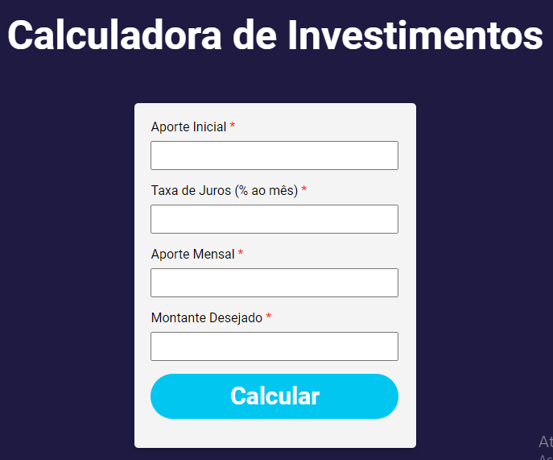

# Calculadora Financeira

Este aplicativo é uma calculadora financeira projetada para ajudar os usuários a planejar seus investimentos. Ele calcula o tempo necessário para alcançar um montante desejado com base em aportes iniciais e mensais, além de uma taxa de juros específica.

## Funcionalidades

- **Cálculo de Tempo de Investimento**: Permite ao usuário descobrir quanto tempo levará para alcançar um montante desejado, considerando o aporte inicial, aporte mensal e a taxa de juros.
- **Interface Amigável**: Interface simples e intuitiva, facilitando o uso por parte dos usuários.
- **Design Responsivo**: Adapta-se bem a diferentes tamanhos de tela, garantindo uma boa experiência de usuário em dispositivos móveis e desktops.

## Tecnologias Utilizadas

- **Frontend**: HTML5, CSS3
- **Backend**: Flask (Python 3.11.8 )
- **Deploy**: Vercel(vou tentar)

## Como Executar o Projeto

<details>
<summary>Para executar este projeto localmente, siga os passos abaixo:</summary>


1. **Clone o Repositório**
   ```
   git clone [URL_DO_REPOSITÓRIO]
   ```
2. **Instale as Dependências** (assumindo que você já tem Python e pip instalados)
   ```
   pip install -r requirements.txt
   ```
3. **Execute o Aplicativo**
   ```
   flask run
   ```
   Após executar este comando, o servidor Flask iniciará e você poderá acessar o aplicativo em `http://localhost:5000` no seu navegador.
</details>

## Estrutura do Projeto

- `app.py`: Arquivo principal do Flask que configura o aplicativo e define as rotas.
- `templates/`: Diretório contendo os arquivos HTML para a interface do usuário.
  - `index_investment_calculation.html`: Página inicial com o formulário de cálculo.
  - `result_investment_calculation.html`: Exibe o resultado do cálculo.
- `static/`: Contém arquivos estáticos, como CSS.
  - `style.css`: Arquivo de estilos CSS para customização da interface.
- `assets/`: Diretório contendo imagens e outros recursos.

## Layout do Aplicativo

A seguir, algumas capturas de tela do aplicativo:

<details>
<summary>Página Inicial: </summary>

  
</details>

<details>
<summary>Resultado do Cálculo: </summary>

  
  </details>